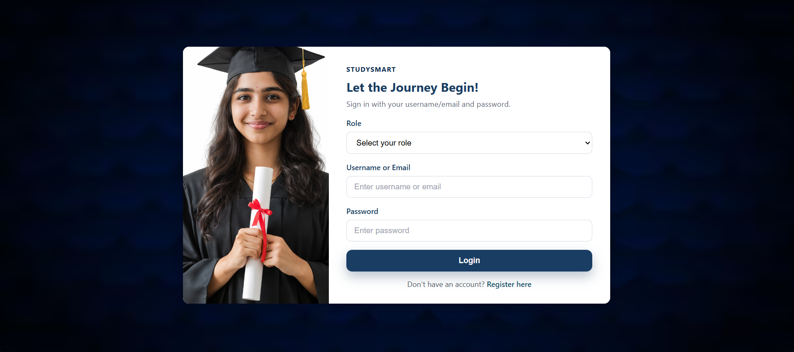
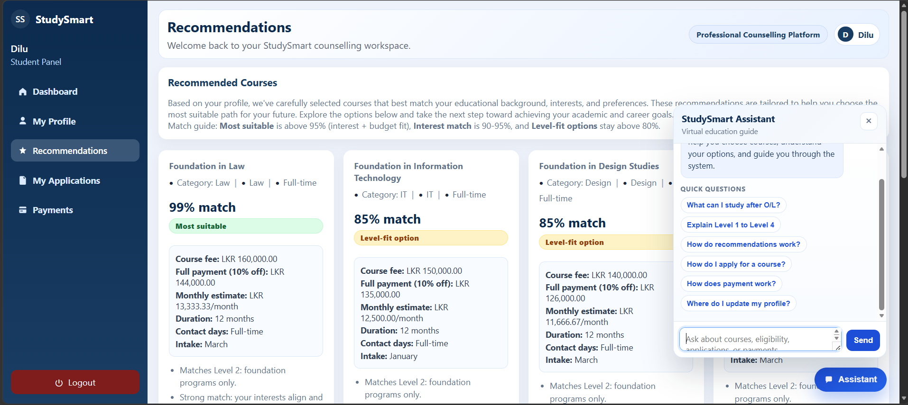
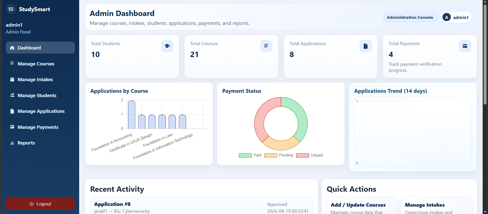
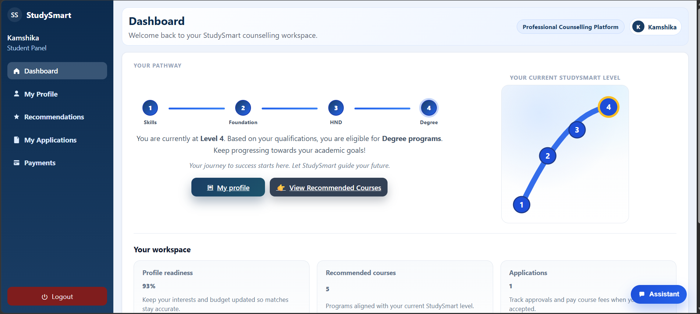

# StudySmart Course Recommendation System (PHP, MySQL, HTML, CSS, JavaScript)

StudySmart is a web-based course recommendation and education guidance system designed to help students discover suitable academic or professional courses based on their interests and goals. The system provides personalized course suggestions along with application support and admin management features.

---

## 🌐 Key Features
- Student registration and login system
- Personalized course recommendation system
- Course browsing and filtering
- Application submission system
- Admin dashboard for managing students, courses, and recommendations
- Responsive and user-friendly UI design
- Secure session-based authentication

---

## 🎯 System Roles
- 👨‍🎓 Student
  - Register and login
  - View recommended courses
  - Explore available programs
  - Submit application requests

- 🧑‍💼 Admin
  - Manage users and student data
  - Add/update/delete courses
  - Monitor application requests
  - Maintain recommendation data

---

## 💻 Technologies Used
- HTML5
- CSS3
- JavaScript
- PHP
- MySQL
- XAMPP Server

---

## 🧠 System Concept
The system works by collecting student preferences (such as interests, career goals, or subject choices) and suggesting relevant courses from the database. This helps students make better educational decisions with proper application guidance.

---

## 📂 Project Structure
/studysmart-course-recommendation
│
├── admin/
├── student/
├── includes/
├── assets/
│ ├── css/
│ ├── js/
│ └── images/
├── database/
│ └── studysmart.sql
├── index.php
├── login.php
├── register.php
├── recommend.php
└── README.md

---

## 🖼 Sample Screenshots

### 🏠 Home Page

### 🔐 Login Page

### 🎯 Course Recommendation Page

### 🧑‍💼 Admin Dashboard

### 🧑‍🎓 Student Dashboard

---

## ⚙️ Installation Guide

1. Install XAMPP (Apache + MySQL)
2. Copy project folder to:
   `C:\xampp\htdocs\studysmart`
3. Start Apache and MySQL in XAMPP
4. Import database file:
   `database/studysmart.sql`
5. Open browser and run:
   `http://localhost/studysmart`
## 🔐 Sample Login Details

**Admin**
- Username: admin1
- Password: admin123

---

## 🎯 Future Improvements
- AI-based recommendation system
- Email notifications for application status
- Chat system between student and admin
- Advanced analytics dashboard

---

## 🔖 License
This project is developed for academic purposes.

---
